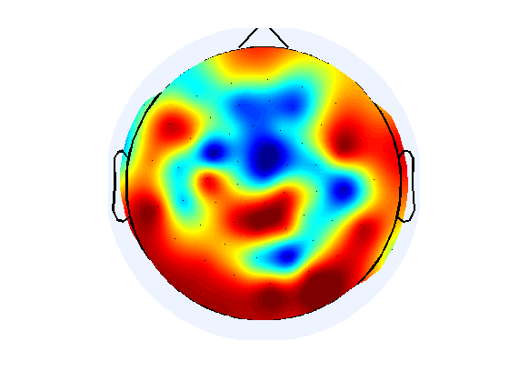
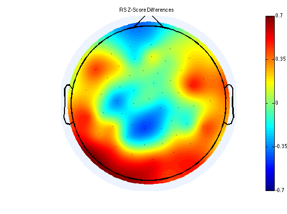
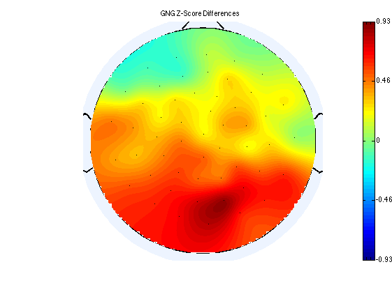
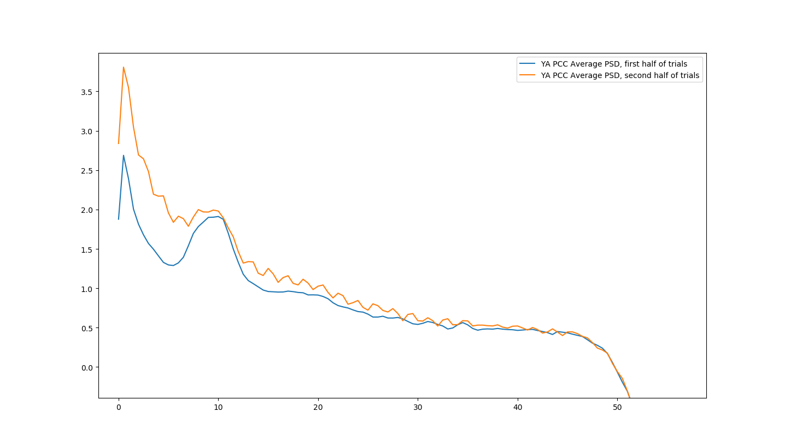
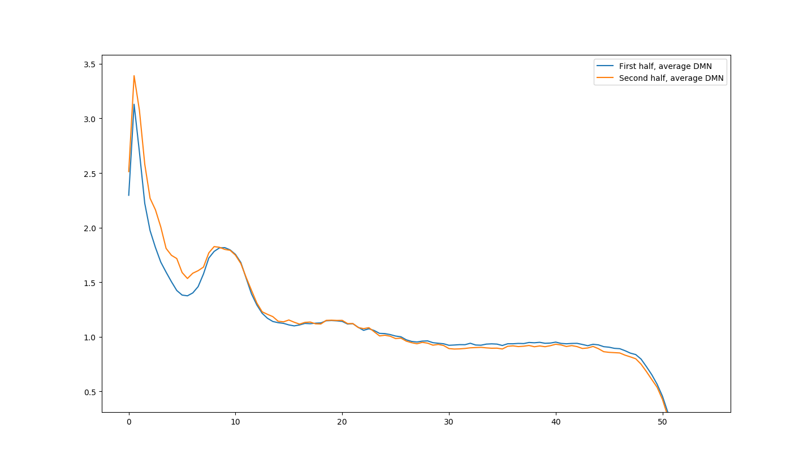
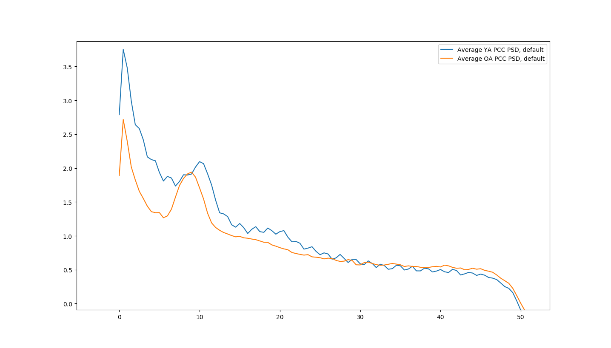
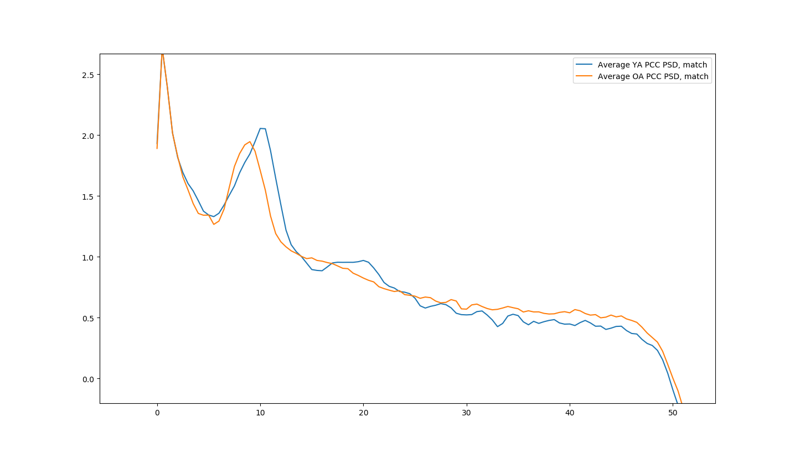

# log

## March 18, 2017
#### construct topoplots using p-values and zscores
To get a more visual idea of which areas are statistically significant, I used the topoplot function to construct topographic maps of either p-values or z-score differences for both the rs and gng data.

Topographic maps were produced using the `generate_topoplots.m` in the CAN Lab toolbox, which uses EEGLAB's `topoplot` function.

##### resting-state data; sensor-level ttests
This is the resulting topographic map of p-values when running t-tests between OAs and YAs on eyesc channels:


And the z-score differences between OAs and YAs:


##### go-nogo data; sensor-level ttests
And for the GNG data, Bob ran z-scores on each subjects' eyesc slopes. These were averaged into a YA average and OA average for each channel, and then we took the difference between them. The difference between mean Z-scores is plotted below:



## March 13, 2017
#### check differences in PSD between first half and second half of YA trials
In order to see if the latter half of YA trials contain more lower-frequency data and thus caused steeper PSD slopes, I ran the YAs in two ways:

1. Take the first half of trials (making them 30 seconds long; 0-30s).
2. Take the second half of trials (31-60s).

If we look at the average PCC PSD for both conditions, we get the following:


The latter half of the trials does show increased lower frequency activity and a more jagged PSD. This might only be reflected in specific channels, however. If we take the mean of all DMN channel PSDs, we get the following:



## March 11, 2017
#### further refactor spectral_slopes.py, analyze results of halving YA trial length

#### more refactoring of spectral_slopes.py
Parameter handling was modified to be cleaner. Using a dict forces parameters added in the future to be printed alongside everything else. Also, commits SHAs are printed/written to the parameters.txt file of each run, so it will always be possible to know what code produced the data for that run.

#### run & analyze results of halving YA trial lengths; restricting wins
I ran subjects with YA trial halving yesterday, but I'm going to run them again today just so we have consistency. Runs in `2017-03-10` have been deleted. I've added `run.sh` at the project root to facilitate running all montages at once.

This analysis is located in `data/runs/2017-03-11/`.
Unfortunately, it seems that cutting YA trials back to match OA trial lengths caused some significant differences to go away. Previously, if we ran a t-test between the OAs and YAs on the DMN, we'd get some fairly clear differences:
##### Default Method: YAs keep 60-second trials.
```
PCC_EYESC:    statistic=2.61, pvalue=0.01042 ----
PCC_EYESO:    statistic=2.98, pvalue=0.00365 ----
mPFC_EYESO:   statistic=1.95, pvalue=0.05344
LAG_EYESC:    statistic=2.47, pvalue=0.01524 ----
RAG_EYESC:    statistic=2.69, pvalue=0.00848 ----
RAG_EYESO:    statistic=2.04, pvalue=0.04401 ----
LLatT_EYESC:  statistic=2.22  pvalue=0.02862 ----
LLatT_EYESO:  statistic=3.34, pvalue=0.00120 ----
RLatT_EYESO:  statistic=2.18, pvalue=0.03164
```

But running it after cutting YA trial length down to match OA lengths:

##### Match OA Method: YA trials are cut down to 30 seconds.
```
PCC_EYESC:    statistic=1.99,  pvalue=0.04950 ----
PCC_EYESO:    statistic=3.29,  pvalue=0.00145 ----
LLatT_EYESC:  statistic=2.55,  pvalue=0.01255 ----
LLatT_EYESO:  statistic=2.49,  pvalue=0.01448 ----
RLatT_EYESO:  statistic=1.93,  pvalue=0.05637
```

We get less significance for all measures except PCC_EYESO, which improves slightly, and drop mPFC_EYESO, LAG_EYESC, and both RAG slopes.

Potentially, this could be due to the younger adults becoming more drowsy as the recording goes on, resulting in increased low-frequency activity. Here are the average PSDs produced for the PCC using the default method:


And here are the average PSDs produced for the PCC, but cutting the YA trials back to 30 seconds.


This seems to imply that later in the YA trial, we get increased lower-frequency activity, as well as a more jagged PSD. Perhaps there is simply less clean information towards the end of the trials. In the next log, we split YA trials into 0-30s and 30-60s and take the PSDs of both, to see if the 30-60s period in YA trials indeed has increased low-frequency activity.


## March 10, 2017
#### refactored spectral_slopes.py to use Subject class, reimplement welch, re-run all subjects with YA trials halved.

##### refactoring spectral_slopes.py
Finished refactoring spectral_slopes.py to use the Subject class.

Attempting to import subject 112118266 resulted in an out of bounds error while attempting to build the event hierarchy. Seems that the evt file got cut off in the middle of trial 105, which indicates the start of an eyes-closed trial. I've manually removed it from the clean evt file.

##### reimplementing welch
Continuing with yesterday, I'm currently attempting to finalize the implementation of Welch's method. It's also important to be aware of the fitting that occurs (to be fair, this is with method #2, where we're taking all clean segments into sp.signal.welch and taking their average), sometimes yielding fits like this:


Which is obviously not reflecting broadband neural noise. We might need to increase the fitting range.

Welch has been reimplemented and fixed. It looks like we'll need to run all analyses again, because this is how old PSDs compare to the current ones:

Old refers to the PSD we were using prior to refactoring, pulled from run `2017-03-07`. New refers to the one we now use. Both are from channel 0 (the PCC source) of subject 1121181181.


**Update:** It looks like PSD calculations were only adversely affected when I restructured get_windows() on March 7. Previously, we were computing them correctly. So the above issue should not affect our findings from previous months. However, we should still see whether we should increase the fitting range in order to better capture broadband activity. (perhaps fitting in log-log space instead of semi-log space would help?)

##### running all subjects again, with YA trials halved
With spectral_slopes finally refactored and verification that the welch implementation is working correctly, I ran spectral_slopes on all subjects again. Results are located in `2017-03-10` runs.


## March 9, 2017
#### implemented class-based structure for Subject, implemented evt trial limiting
Much of the subject-processing functionality in spectral_slopes.py has been seperated into a separate class: Subject, located in subject.py. Event files are now imported straight from the processed df-transformed evts. The `Subject` class is structured so that a heirarchy of dataframes specifying event-related information is built when a new object is instantiated:
```python
s = Subject('1121181181.mat', '1121181181.evt')
```

The original evt dataframe is accessible: `s.events['df']`. However, four other dataframes are built from this one:
```python
s.events['eyesc']
s.events['eyeso']
s.events['trials_eyesc']
s.events['trials_eyeso']
```

Whenever event-related information is modified in `s.events['df']`, using the function `Subject.modify_trial_length()`, changes get propagated down to the other dataframes listed above. This ensure that events are always consistent.

Additionally, attempting to figure out how to implement welch. Running welch on all of the clean segments and then averaging their PSDs together of course gives us smoother spectra than if we manually take take the spectra of 2-second 50% overlap windows, we seem to not only get more jagged spectra but less distinctive alpha peaks, too. Here are some examples:

A single channel from subject 1121181181, using the manual window extraction method.


The same channel, but simply passing all clean segments into sp.signal.welch and taking their average.


Will look at this tomorrow.


## March 8, 2017
#### .mat files now include all information, including trials
Previously, I only exported the clean segment markers into python. In order to be able to work with the trial markers during the spectral_slopes.py analysis, I'm including the trial markers in the event information that gets exported through set_mat_converter.m. The following were used to do this (i.e. same as March 6 entry, but without segments parameter):
```matlab
% Default Mode Network
cl_modifyevents('data/rs/full/source-dmn/MagCleanEvtFiltCAR-set/',...
                'data/rs/full/evt/clean/',...
                'data/rs/full/source-dmn/MagCleanEvtFiltCAR-set/');
set_mat_converter('data/rs/full/source-dmn/MagCleanEvtFiltCAR-set/',...
                  'data/rs/full/source-dmn/MagCleanEvtFiltCAR-mat/');

% Frontal
cl_modifyevents('data/rs/full/source-frontal/MagEvtFiltCAR-set/',...
                'data/rs/full/evt/clean/',...
                'data/rs/full/source-frontal/MagCleanEvtFiltCAR-set/');
set_mat_converter('data/rs/full/source-frontal/MagCleanEvtFiltCAR-set/',...
                  'data/rs/full/source-frontal/MagCleanEvtFiltCAR-mat/');

% Dorsal
mkdir 'data/rs/full/source-dorsal/MagCleanEvtFiltCAR-set'
mkdir 'data/rs/full/source-dorsal/MagCleanEvtFiltCAR-mat'
cl_modifyevents('data/rs/full/source-dorsal/MagEvtFiltCAR-set/',...
                'data/rs/full/evt/clean/',...
                'data/rs/full/source-dorsal/MagCleanEvtFiltCAR-set/');
set_mat_converter('data/rs/full/source-dorsal/MagCleanEvtFiltCAR-set/',...
                  'data/rs/full/source-dorsal/MagCleanEvtFiltCAR-mat/');

% Ventral
mkdir 'data/rs/full/source-ventral/MagCleanEvtFiltCAR-set'
mkdir 'data/rs/full/source-ventral/MagCleanEvtFiltCAR-mat'
cl_modifyevents('data/rs/full/source-ventral/MagEvtFiltCAR-set/',...
                'data/rs/full/evt/clean/',...
                'data/rs/full/source-ventral/MagCleanEvtFiltCAR-set/');
set_mat_converter('data/rs/full/source-ventral/MagCleanEvtFiltCAR-set/',...
                  'data/rs/full/source-ventral/MagCleanEvtFiltCAR-mat/');

% Sensor-level data
mkdir 'data/rs/full/original/ExclFiltCleanEvtCARClust-set'
mkdir 'data/rs/full/original/ExclFiltCleanEvtCARClust-mat'
cl_modifyevents('data/rs/full/original/ExclFiltCARClust-set/',...
                'data/rs/full/evt/clean/',...
                'data/rs/full/original/ExclFiltCleanEvtCARClust-set/');
set_mat_converter('data/rs/full/original/ExclFiltCleanEvtCARClust-set/',...
                  'data/rs/full/original/ExclFiltCleanEvtCARClust-mat/');
```


## March 7, 2017
#### reran spectral_slopes.py on all files, updated get_windows()
Ran spectral_slopes.py as specified in previous entry. There was an issue with windows being extracted in the incorrect way, resulting in inconsistencies in window size. Reimplementing get_windows() fixed the issue.

Results of re-running files have been placed in results/clean-evt/.


## March 6, 2017
#### Restructured src/rs/full, updated evt data, added evt data to set files.
src/rs/full has been restructured into preprocessing and analysis folders.

The resting-state evt files we were using for older adults had some problems. See the [evt-data](https://github.com/canlabluc/evt-data) project for more information. This might be a confound for the PSD analysis because some trials in the recording (primarily eyes-closed trials) were being wholly marked as clean data. EMG artifact, which I assume trials sometimes contained, is generally characterized by high-frequency oscillations, which could account for the flatter PSD slope in the older adults.

Additionally, some of the segments that were marked as being clean data were sitting either completely in the intertrial period or partially inside of it. The preprocessing scripts fix this.

In order to address these issues, I'm running all of our full recording data through the analysis again, but this time with the cleaned up evt files. We'll be able to see how much this impacts:

1. Number of windows able to be extracted for PSD computation (there will likely be considerably fewer extractable windows)
2. The difference in neural noise between older and younger adults

Here are the steps to do so:

Producing the clean evt files:
```
$ bash src/rs/full/preprocessing/produce_clean_evt_files.sh
```

Then, we change the event information for all of the source models and the sensor-level data, exporting them to new folders with the `MagCleanEvtFiltCAR` designation by running the following from the the root project directory:

```matlab
% Default Mode Network
mkdir 'data/rs/full/source-dmn/MagCleanEvtFiltCAR-set'
mkdir 'data/rs/full/source-dmn/MagCleanEvtFiltCAR-mat'
cl_modifyevents('data/rs/full/source-dmn/MagEvtFiltCAR-set/',...
                'data/rs/full/evt/clean/',...
                'data/rs/full/source-dmn/MagCleanEvtFiltCAR-set/',...
                {'C', 'O'});
set_mat_converter('data/rs/full/source-dmn/MagCleanEvtFiltCAR-set/',...
                  'data/rs/full/source-dmn/MagCleanEvtFiltCAR-mat/');

% Frontal
mkdir 'data/rs/full/source-frontal/MagCleanEvtFiltCAR-set'
mkdir 'data/rs/full/source-frontal/MagCleanEvtFiltCAR-mat'
cl_modifyevents('data/rs/full/source-frontal/MagEvtFiltCAR-set/',...
                'data/rs/full/evt/clean/',...
                'data/rs/full/source-frontal/MagCleanEvtFiltCAR-set/',...
                {'C', 'O'});
set_mat_converter('data/rs/full/source-frontal/MagCleanEvtFiltCAR-set/',...
                  'data/rs/full/source-frontal/MagCleanEvtFiltCAR-mat/');

% Dorsal
mkdir 'data/rs/full/source-dorsal/MagCleanEvtFiltCAR-set'
mkdir 'data/rs/full/source-dorsal/MagCleanEvtFiltCAR-mat'
cl_modifyevents('data/rs/full/source-dorsal/MagEvtFiltCAR-set/',...
                'data/rs/full/evt/clean/',...
                'data/rs/full/source-dorsal/MagCleanEvtFiltCAR-set/',...
                {'C', 'O'});
set_mat_converter('data/rs/full/source-dorsal/MagCleanEvtFiltCAR-set/',...
                  'data/rs/full/source-dorsal/MagCleanEvtFiltCAR-mat/');

% Ventral
mkdir 'data/rs/full/source-ventral/MagCleanEvtFiltCAR-set'
mkdir 'data/rs/full/source-ventral/MagCleanEvtFiltCAR-mat'
cl_modifyevents('data/rs/full/source-ventral/MagEvtFiltCAR-set/',...
                'data/rs/full/evt/clean/',...
                'data/rs/full/source-ventral/MagCleanEvtFiltCAR-set/',...
                {'C', 'O'});
set_mat_converter('data/rs/full/source-ventral/MagCleanEvtFiltCAR-set/',...
                  'data/rs/full/source-ventral/MagCleanEvtFiltCAR-mat/');

% Sensor-level data
mkdir 'data/rs/full/original/ExclFiltCleanEvtCARClust-set'
mkdir 'data/rs/full/original/ExclFiltCleanEvtCARClust-mat'
cl_modifyevents('data/rs/full/original/ExclFiltCARClust-set/',...
                'data/rs/full/evt/clean/',...
                'data/rs/full/original/ExclFiltCleanEvtCARClust-set/',...
                {'C', 'O'});
set_mat_converter('data/rs/full/original/ExclFiltCleanEvtCARClust-set/',...
                  'data/rs/full/original/ExclFiltCleanEvtCARClust-mat/');
```

Then we run `spectral_slopes.py` on the new data:
```bash
python src/rs/full/analysis/spectral_slopes.py -m dmn          -i data/rs/full/source-dmn/MagCleanEvtFiltCAR-mat/     -o data/runs/
python src/rs/full/analysis/spectral_slopes.py -m frontal      -i data/rs/full/source-frontal/MagCleanEvtFiltCAR-mat/ -o data/runs/
python src/rs/full/analysis/spectral_slopes.py -m ventral      -i data/rs/full/source-ventral/MagCleanEvtFiltCAR-mat/ -o data/runs/
python src/rs/full/analysis/spectral_slopes.py -m dorsal       -i data/rs/full/source-dorsal/MagCleanEvtFiltCAR-mat/  -o data/runs/
python src/rs/full/analysis/spectral_slopes.py -m sensor-level -i data/rs/full/original/ExclFiltCleanEvtCARClust-mat/ -o data/runs/
```
