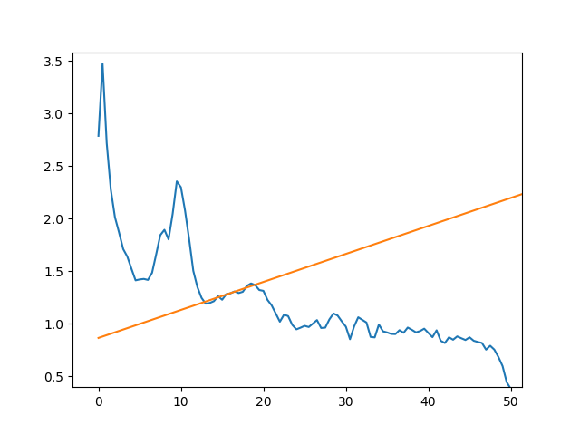
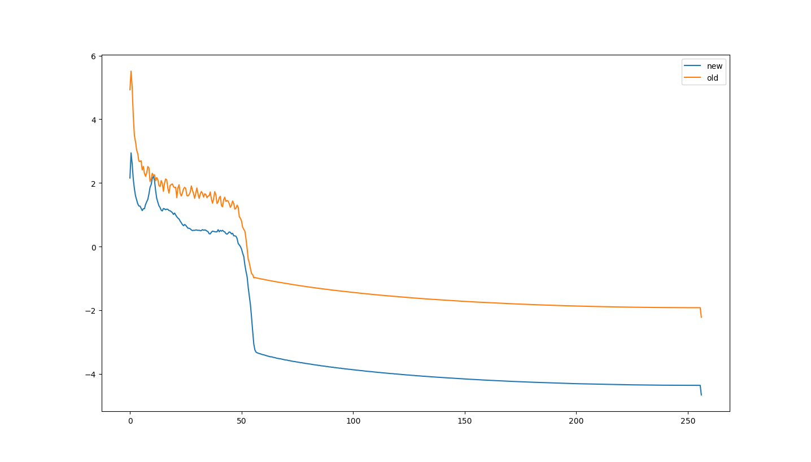
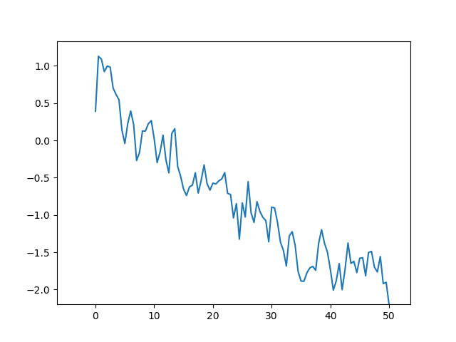
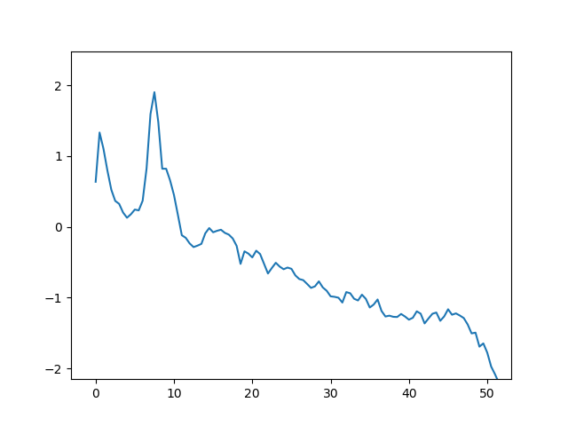

# log

## March 10, 2017
#### refactored spectral_slopes.py to use Subject class, reimplement welch

##### refactoring spectral_slopes.py
Finished refactoring spectral_slopes.py to use the Subject class. New implementation was tested by running dmn source-model:
```bash
$ python src/rs/full/analysis/spectral_slopes_v2.py -m dmn -i data/rs/full/source-dmn/MagCleanEvtFiltCAR-mat/ -o data/runs/
```

Attempting to import subject 112118266 resulted in an out of bounds error while attempting to build the event hierarchy. Seems that the evt file got cut off in the middle of trial 105, which indicates the start of an eyes-closed trial. I've manually removed it from the clean evt file.

###### reimplementing welch
Continuing with yesterday, I'm currently attempting to finalize the implementation of Welch's method. It's also important to be aware of the fitting that occurs (to be fair, this is with method #2, where we're taking all clean segments into sp.signal.welch and taking their average), sometimes yielding fits like this:


Which is obviously not reflecting broadband neural noise. We might need to increase the fitting range.

Welch has been reimplemented and fixed. It looks like we'll need to run all analyses again, because this is how old PSDs compare to the current ones:

Old refers to the PSD we were using prior to refactoring, pulled from run `2017-03-07`. New refers to the one we now use. Both are from channel 0 (the PCC source) of subject 1121181181. 


We'll have to run everything over again to see if there are still significant differences between age groups. Hopefully the old PSD was still reflecting broadband activity, and the new one simply shows it more clearly.


## March 9, 2017
#### implemented class-based structure for Subject, implemented evt trial limiting
Much of the subject-processing functionality in spectral_slopes.py has been seperated into a separate class: Subject, located in subject.py. Event files are now primarily imported straight from the processed df-transformed evts. Additionally, attempting to figure out how to implement welch. Running welch on all of the clean segments and then averaging their PSDs together of course gives us smoother spectra than if we manually take take the spectra of 2-second 50% overlap windows, we seem to not only get more jagged spectra but less distinctive alpha peaks, too. Here are some examples:

A single channel from subject 1121181181, using the manual window extraction method.


The same channel, but simply passing all clean segments into sp.signal.welch and taking their average.


Will look at this tomorrow.


## March 8, 2017
#### .mat files now include all information, including trials
Previously, I only exported the clean segment markers into python. In order to be able to work with the trial markers during the spectral_slopes.py analysis, I'm including the trial markers in the event information that gets exported through set_mat_converter.m. The following were used to do this (i.e. same as March 6 entry, but without segments parameter):
```matlab
% Default Mode Network
cl_modifyevents('data/rs/full/source-dmn/MagCleanEvtFiltCAR-set/',...
                'data/rs/full/evt/clean/',...
                'data/rs/full/source-dmn/MagCleanEvtFiltCAR-set/');
set_mat_converter('data/rs/full/source-dmn/MagCleanEvtFiltCAR-set/',...
                  'data/rs/full/source-dmn/MagCleanEvtFiltCAR-mat/');

% Frontal
cl_modifyevents('data/rs/full/source-frontal/MagEvtFiltCAR-set/',...
                'data/rs/full/evt/clean/',...
                'data/rs/full/source-frontal/MagCleanEvtFiltCAR-set/');
set_mat_converter('data/rs/full/source-frontal/MagCleanEvtFiltCAR-set/',...
                  'data/rs/full/source-frontal/MagCleanEvtFiltCAR-mat/');

% Dorsal
mkdir 'data/rs/full/source-dorsal/MagCleanEvtFiltCAR-set'
mkdir 'data/rs/full/source-dorsal/MagCleanEvtFiltCAR-mat'
cl_modifyevents('data/rs/full/source-dorsal/MagEvtFiltCAR-set/',...
                'data/rs/full/evt/clean/',...
                'data/rs/full/source-dorsal/MagCleanEvtFiltCAR-set/');
set_mat_converter('data/rs/full/source-dorsal/MagCleanEvtFiltCAR-set/',...
                  'data/rs/full/source-dorsal/MagCleanEvtFiltCAR-mat/');

% Ventral
mkdir 'data/rs/full/source-ventral/MagCleanEvtFiltCAR-set'
mkdir 'data/rs/full/source-ventral/MagCleanEvtFiltCAR-mat'
cl_modifyevents('data/rs/full/source-ventral/MagEvtFiltCAR-set/',...
                'data/rs/full/evt/clean/',...
                'data/rs/full/source-ventral/MagCleanEvtFiltCAR-set/');
set_mat_converter('data/rs/full/source-ventral/MagCleanEvtFiltCAR-set/',...
                  'data/rs/full/source-ventral/MagCleanEvtFiltCAR-mat/');

% Sensor-level data
mkdir 'data/rs/full/original/ExclFiltCleanEvtCARClust-set'
mkdir 'data/rs/full/original/ExclFiltCleanEvtCARClust-mat'
cl_modifyevents('data/rs/full/original/ExclFiltCARClust-set/',...
                'data/rs/full/evt/clean/',...
                'data/rs/full/original/ExclFiltCleanEvtCARClust-set/');
set_mat_converter('data/rs/full/original/ExclFiltCleanEvtCARClust-set/',...
                  'data/rs/full/original/ExclFiltCleanEvtCARClust-mat/');
```


## March 7, 2017
#### reran spectral_slopes.py on all files, updated get_windows()
Ran spectral_slopes.py as specified in previous entry. There was an issue with windows being extracted in the incorrect way, resulting in inconsistencies in window size. Reimplementing get_windows() fixed the issue. 

Results of re-running files have been placed in results/clean-evt/.


## March 6, 2017
#### Restructured src/rs/full, updated evt data, added evt data to set files.
src/rs/full has been restructured into preprocessing and analysis folders.

The resting-state evt files we were using for older adults had some problems. See the [evt-data](https://github.com/canlabluc/evt-data) project for more information. This might be a confound for the PSD analysis because some trials in the recording (primarily eyes-closed trials) were being wholly marked as clean data. EMG artifact, which I assume trials sometimes contained, is generally characterized by high-frequency oscillations, which could account for the flatter PSD slope in the older adults.

Additionally, some of the segments that were marked as being clean data were sitting either completely in the intertrial period or partially inside of it. The preprocessing scripts fix this.

In order to address these issues, I'm running all of our full recording data through the analysis again, but this time with the cleaned up evt files. We'll be able to see how much this impacts:

1. Number of windows able to be extracted for PSD computation (there will likely be considerably fewer extractable windows)
2. The difference in neural noise between older and younger adults

Here are the steps to do so:

Producing the clean evt files:
```
$ bash src/rs/full/preprocessing/produce_clean_evt_files.sh
```

Then, we change the event information for all of the source models and the sensor-level data, exporting them to new folders with the `MagCleanEvtFiltCAR` designation by running the following from the the root project directory:

```matlab
% Default Mode Network
mkdir 'data/rs/full/source-dmn/MagCleanEvtFiltCAR-set'
mkdir 'data/rs/full/source-dmn/MagCleanEvtFiltCAR-mat'
cl_modifyevents('data/rs/full/source-dmn/MagEvtFiltCAR-set/',...
                'data/rs/full/evt/clean/',...
                'data/rs/full/source-dmn/MagCleanEvtFiltCAR-set/',...
                {'C', 'O'});
set_mat_converter('data/rs/full/source-dmn/MagCleanEvtFiltCAR-set/',...
                  'data/rs/full/source-dmn/MagCleanEvtFiltCAR-mat/');

% Frontal
mkdir 'data/rs/full/source-frontal/MagCleanEvtFiltCAR-set'
mkdir 'data/rs/full/source-frontal/MagCleanEvtFiltCAR-mat'
cl_modifyevents('data/rs/full/source-frontal/MagEvtFiltCAR-set/',...
                'data/rs/full/evt/clean/',...
                'data/rs/full/source-frontal/MagCleanEvtFiltCAR-set/',...
                {'C', 'O'});
set_mat_converter('data/rs/full/source-frontal/MagCleanEvtFiltCAR-set/',...
                  'data/rs/full/source-frontal/MagCleanEvtFiltCAR-mat/');

% Dorsal
mkdir 'data/rs/full/source-dorsal/MagCleanEvtFiltCAR-set'
mkdir 'data/rs/full/source-dorsal/MagCleanEvtFiltCAR-mat'
cl_modifyevents('data/rs/full/source-dorsal/MagEvtFiltCAR-set/',...
                'data/rs/full/evt/clean/',...
                'data/rs/full/source-dorsal/MagCleanEvtFiltCAR-set/',...
                {'C', 'O'});
set_mat_converter('data/rs/full/source-dorsal/MagCleanEvtFiltCAR-set/',...
                  'data/rs/full/source-dorsal/MagCleanEvtFiltCAR-mat/');

% Ventral
mkdir 'data/rs/full/source-ventral/MagCleanEvtFiltCAR-set'
mkdir 'data/rs/full/source-ventral/MagCleanEvtFiltCAR-mat'
cl_modifyevents('data/rs/full/source-ventral/MagEvtFiltCAR-set/',...
                'data/rs/full/evt/clean/',...
                'data/rs/full/source-ventral/MagCleanEvtFiltCAR-set/',...
                {'C', 'O'});
set_mat_converter('data/rs/full/source-ventral/MagCleanEvtFiltCAR-set/',...
                  'data/rs/full/source-ventral/MagCleanEvtFiltCAR-mat/');

% Sensor-level data
mkdir 'data/rs/full/original/ExclFiltCleanEvtCARClust-set'
mkdir 'data/rs/full/original/ExclFiltCleanEvtCARClust-mat'
cl_modifyevents('data/rs/full/original/ExclFiltCARClust-set/',...
                'data/rs/full/evt/clean/',...
                'data/rs/full/original/ExclFiltCleanEvtCARClust-set/',...
                {'C', 'O'});
set_mat_converter('data/rs/full/original/ExclFiltCleanEvtCARClust-set/',...
                  'data/rs/full/original/ExclFiltCleanEvtCARClust-mat/');
```

Then we run `spectral_slopes.py` on the new data:
```bash
$ python src/rs/full/analysis/spectral_slopes.py -m source-level -i data/rs/full/original/ExclFiltCleanEvtCARClust-mat/ -o data/runs/
$ python src/rs/full/analysis/spectral_slopes.py -m dmn          -i data/rs/full/source-dmn/MagCleanEvtFiltCAR-mat/     -o data/runs/
$ python src/rs/full/analysis/spectral_slopes.py -m frontal      -i data/rs/full/source-frontal/MagCleanEvtFiltCAR-mat/ -o data/runs/
$ python src/rs/full/analysis/spectral_slopes.py -m ventral      -i data/rs/full/source-ventral/MagCleanEvtFiltCAR-mat/ -o data/runs/
$ python src/rs/full/analysis/spectral_slopes.py -m dorsal       -i data/rs/full/source-dorsal/MagCleanEvtFiltCAR-mat/  -o data/runs/
```
