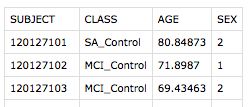
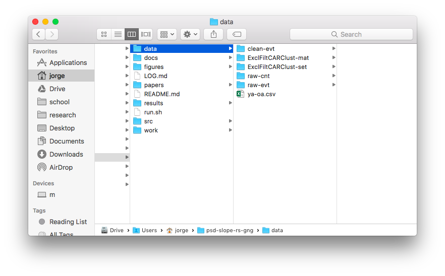
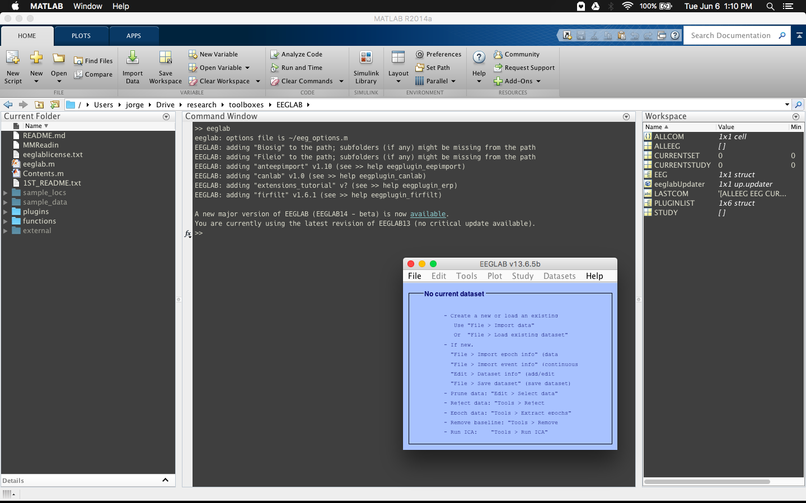
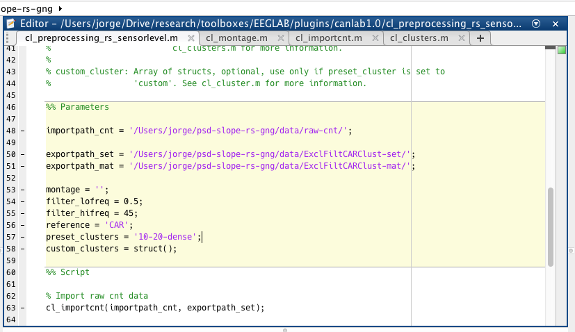
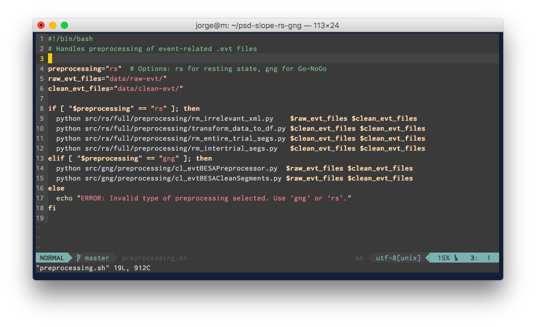
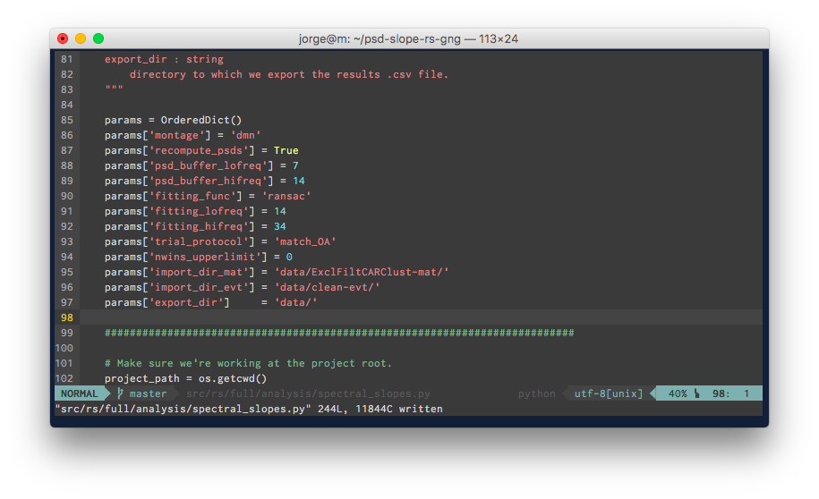

# pipeline for resting state data

This file specifies the pipeline utilized to process and calculate the neural noise of participants in studies 127 and 118, during resting state. For the purposes of demonstration, we'll be running the neural noise analysis on sensor-level data.

## required files
- Comma-separated values file containing subject information.
- Full-length EEG recordings (with .cnt or .bdf file extension).
- Corresponding event files marking out clean segments, exported from EMSE with the .evt file extension.

An example of what the .csv file should look like:



# steps

**Download this repository, and organize data.** For instructions on how to download (AKA clone) a GitHub repository, see [here](https://help.github.com/articles/cloning-a-repository/). Once it's downloaded, create a folder structure like so to hold the data:



Place .cnt files in `raw-cnt/`, and the .evt files in `raw-evt/`. `clean-evt/` is for holding the processed .evt files, and `ExclFiltCARClust-set/` as well as `ExclFiltCARClust-mat/` is for holding the processed EEG files. We create two because Python only reads files of type `.mat`, whereas EEGLAB stores EEG files as `.set`. 'ExclFiltCARClust' specifies that the folder holds EEG data which has had certain channels excluded, had a bandpass filter applied, re-referenced to the common average (CAR), and computed several channel clusters. `ya-oa.csv` is the csv file containing subject information.

**Open up MATLAB, and make sure that CAN Lab's EEGLAB plugin is available.** If you've not downloaded CAN Lab's EEGLAB repository yet, it is available [here](https://github.com/canlabluc/EEGLAB).

**Start EEGLAB.** To do that, navigate to where you've downloaded it, and type 'eeglab' into the MATLAB command window, without the quotes. Here's a screenshot of me doing so. Notice that EEGLAB notifies us that it's added a plugin called "canlab", and creates a blue menu.



**Preprocess the EEG data.** Open up `cl_preprocessing_rs_sensorlevel.m`, and change the variables under `%% Parameters` to point to where you've placed your .cnt files, where you'd like to save your .set (EEGLAB-accessible) files, and where you'd like to save your .mat (Python-accessible) files. Like so:



Modify the other parameters if needed. See the documentation written right above the parameters for more information about what values can be set here. Once everything is in order, run `cl_preprocessing_rs_sensorlevel.m`. This will generally take a while. Close MATLAB once it's done, since every step from here uses Python.

**Preprocess the event-related .evt files.** Open up a text editor and edit the two paths in `preprocessing.sh` (located at the root of this repository) to point to where you've placed the EMSE-exported event-related files. Also, edit the variable `preprocessing` to "rs", since we're analyzing resting-state data.



Then, open up terminal, navigate to the location of the repository on your computer (for me it's `~/psd-slope-rs-gng`), and run it (ignore the $, that's just the terminal prompt):

```bash
$ bash preprocessing.sh
```

**Run the neural noise analysis.** Open up a text editor and edit the parameters in `src/rs/full/spectral_analysis.py` to the appropriate values. This is how mine looks:



Then we run it from the project root:

```bash
$ python src/rs/full/analysis/spectral_slopes.py
```

This will create a new directory titled with today's date and montage (in this case, 'sensor-level') containing three files:
- **parameters.txt:** Text file containing the parameters that were used for the analysis.
- **rs-full-sensor-level-ransac-14-34.csv:** Comma-separated values file containing the results of the analysis.
- **subj-14-34-ransac.npy:** The pickled subj dictionary, which was used to generate the .csv file. Loading it into memory while in Python is done like so: `subj = np.load('subj-14-34-ransac.npy').item()`.
